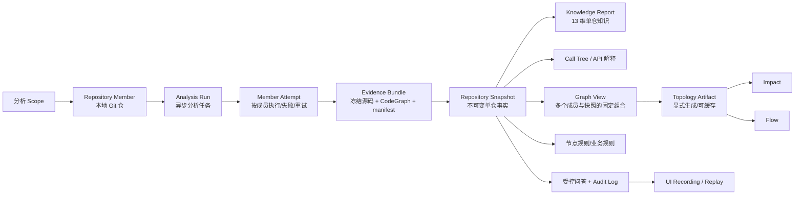
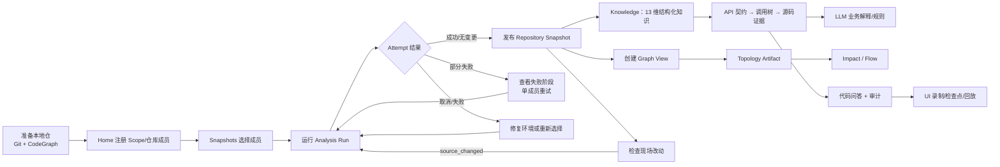

# CodeEvolution 产品需求文档（PRD）

> 文档版本：0.1（代码基线版）  
> 状态：Draft  
> 目标仓库：`services/codehistory`  
> 编写依据：当前源码、Web 页面、API 合约、测试和既有设计文档

## 1. 产品摘要

CodeEvolution 是一个本地优先的代码仓功能演进分析与业务知识逆向工作台。它把一个或多个本地 Git 仓库接入分析范围，显式生成带完整证据的代码分析快照，再用结构化知识、跨仓拓扑、调用链、业务解释、受控问答和 UI 回放，帮助团队回答：

> “这段代码实现了什么？一次改动会影响什么？我如何验证它没有破坏关键旅程？”

产品的核心价值不是生成一份脱离源码的总结，而是让每个结论都能回到固定 Snapshot 中的图谱节点、文件和行号。LLM 只负责语义增强，不能替代代码事实，也不能执行任意 SQL 或修改代码。

## 2. 背景与问题

### 2.1 用户问题

| 问题 | 具体表现 | CodeEvolution 的解决方式 |
|---|---|---|
| 代码与业务语言断裂 | 产品、测试和新成员难以从 API/函数名理解业务流程 | 从 API、调用链和源码生成业务描述、规则、错误目录和状态机 |
| 单仓视角不足 | 服务依赖、消息链路和共享资源分散在多个仓库 | 将多个 Repository Member 固定到同一个 Graph View，生成带证据的拓扑 |
| 变更影响不可见 | 开发者不知道上游、下游和潜在受影响的入口 | 通过调用图、影响分析和流程追踪查询传播路径 |
| 分析结果不可信或不可复现 | 实时读取现场代码导致结果随时间漂移 | 显式 Analysis Run，冻结源码和 CodeGraph，发布不可变 Snapshot |
| 自动化测试与代码知识脱节 | 测试缺口、业务规则和浏览器回归用例互相孤立 | 从知识中心进入 UI 录制、检查点和回放闭环 |

### 2.2 产品假设

- 用户可以访问目标仓库的本地绝对路径，且目标目录是 Git 仓库。
- 目标仓库使用 CodeGraph 建立或可建立 `.codegraph/codegraph.db`。
- CodeEvolution 运行在本机或受控工作站上，数据默认保存在本地数据目录。
- 结构化分析无需 LLM；业务语义、业务规则、API 功能解释等能力需要用户配置 LLM。
- UI 录制需要本机 Kimi WebBridge 和目标站点 origin 白名单。

## 3. 产品目标与非目标

### 3.1 目标

1. 用户能在一次明确的分析操作后获得可信、可定位的单仓知识快照。
2. 用户能从一个 API 入口展开调用树，并定位到快照内的源码证据。
3. 架构师和开发者能在固定的多仓快照组合上查看拓扑、上游/下游影响和流程。
4. 产品经理、测试和开发能在结构化事实之上获取可审阅的业务解释。
5. 失败、取消、部分成功和现场代码变化都能被看见、解释和恢复。
6. 结果能被问答、审计、UI 测试和后续重新分析复用。

### 3.2 非目标

- 不自动修改源码、提交 Git、创建 PR 或执行修复。
- 不把 LLM 推断当作业务事实；不承诺语义解释 100% 正确。
- 当前版本不提供远程 Git 托管平台同步、团队协作评论、账号体系或细粒度权限管理。
- 不以实时文件监听替代用户触发的分析 Run；页面打开本身不应产生新 Snapshot。
- 不将共享 Redis/数据库资源自动等同于服务间 API 调用。
- 跨 Snapshot diff、版本趋势看板和报告导出不是当前主闭环的必备能力；已有导出入口仅覆盖已固定的 Graph View。

## 4. 用户与角色

产品当前是本地工作台，代码中没有账号登录和角色授权 UI。以下是按任务划分的产品角色，而不是系统权限角色。

| 角色 | 核心任务 | 最重要的产物 | 优先级 |
|---|---|---|---:|
| 产品经理/业务分析师 | 从 API 和调用链理解业务流程、规则和副作用 | API 功能解释、业务流程、验收线索 | P0 |
| 架构师 | 理解模块边界、服务拓扑、依赖和影响范围 | Graph View、拓扑证据、影响路径 | P0 |
| 开发者 | 定位符号、调用方/被调用方和变更风险 | 调用树、源码位置、受控问答结果 | P0 |
| 测试工程师 | 找到覆盖缺口，将业务旅程转成可回放用例 | 测试缺口、UI Recording、检查点结果 | P1 |
| 运维/平台工程师 | 识别外部依赖、配置、权限和服务健康问题 | 依赖清单、配置消费、权限模型、拓扑 | P1 |

## 5. 产品核心模型

### 5.1 术语定义

| 术语 | 定义 | 用户可见意义 |
|---|---|---|
| Scope | 一组逻辑相关的仓库成员，通常对应一个产品或服务集合 | 在 Home/Snapshots 中组织仓库 |
| Repository Member | Scope 下的一个本地 Git 仓库及其稳定身份 | 选择分析的最小单元 |
| Analysis Run | 一次对一个或多个成员的异步分析请求 | 可轮询、取消和重试 |
| Attempt | Run 中某一个成员的独立执行记录 | 展示阶段、进度、错误和是否发布 Snapshot |
| Evidence Bundle | 采集时冻结的源码、CodeGraph、清单和摘要 | 结果可复现、可校验的底座 |
| Repository Snapshot | 某成员在某次成功采集时的不可变事实 | Knowledge、调用链和问答的唯一事实来源 |
| current Snapshot | 成员当前默认指向的最新成功结果 | 新结果发布后更新，旧 Snapshot 保留 |
| Graph View | 成员与指定 Snapshot 的固定组合 | 跨仓分析和结果复查的稳定身份 |
| Topology Artifact | 针对 Graph View 显式生成的拓扑分析结果 | 服务边、证据、覆盖、候选和资源依赖 |
| 代码事实 | 来自冻结 CodeGraph/源码的节点、边、文件和行号 | 可定位、可审计 |
| 语义推断 | LLM 生成的业务摘要、规则、错误或状态解释 | 需要标注模型、覆盖率并允许失败 |

### 5.2 不变量

1. Knowledge、Call Tree、Chat、Node Rule 和 API Explanation 必须绑定 `repository_snapshot_id`；不能偷偷读取注册目录的最新现场代码。
2. Graph View 必须固定成员及其 Snapshot 映射；拓扑、Impact 和 Flow 必须使用同一个 `view_id`。
3. 分析过程中源码发生变化时，Attempt 失败，不得发布半新半旧的 Snapshot。
4. Run 的一个成员失败不应回滚同一 Run 中其他成员已经发布的成功 Snapshot。
5. 取消、失败、空间不足、路径失效或 CodeGraph 失败都必须保留可诊断状态。
6. 只读问答只能执行白名单查询；用户和模型都不能通过问答提交任意 SQL。

## 6. 核心用户旅程

主旅程的“完成”不是打开某个页面，而是用户针对一个真实问题获得了可定位的证据或一个可验证的测试结果。

## 7. 功能需求

优先级说明：P0 为当前主闭环的必备能力；P1 为高价值增强；P2 为后续产品化方向。状态是基于当前代码的实现判断，不代表未来承诺。

| ID | 优先级 | 需求 | 验收标准 | 当前实现状态/代码证据 |
|---|---:|---|---|---|
| FR-01 | P0 | 注册和管理 Scope、Repository Member | 能创建 Scope；只能添加可读的 Git 目录；可查看、更新、移除成员；移除不删除实际代码和历史 Snapshot | 已实现：`/api/scopes*`、`RepositoryCatalogService`、`Home.vue` |
| FR-02 | P0 | 显式发起可追踪的分析 Run | 选择一个或多个成员后创建异步 Run；页面显示每个 Attempt 的阶段和错误；可取消 Run/成员；失败成员可重试 | 已实现：`/api/analysis-runs*`、`AnalysisRunService`、`Snapshots.vue` |
| FR-03 | P0 | 生成不可变、可校验的 Repository Snapshot | 分析前后校验源码 digest；冻结 CodeGraph、源码和 manifest；成功后才发布；保留 branch/head/dirty/完整性信息 | 已实现：`RepositoryAttemptWorker`、`EvidenceBundle`、Snapshot 存储 |
| FR-04 | P0 | 浏览单仓结构化知识 | Snapshot 可展示 API 契约、模块拓扑、核心实体、测试缺口、分层违规、配置、外部依赖、权限和热力图等维度；每项保留来源位置 | 已实现：`/api/knowledge`、`Knowledge.vue`、`analysis/knowledge/` |
| FR-05 | P0 | 从 API 入口查看调用链 | 用户可筛选 API、展开节点、查看调用位置和时序图；节点展开使用 Snapshot 内的 CodeGraph ID | 已实现：`/api/call-tree/children`、`CallChainTree.vue` |
| FR-06 | P0 | 固定多个仓库的 Graph View | 能按成员当前 Snapshot 创建 View；View 显示成员、digest 和可用性；固定后可复查/导出 | 已实现 API：`/api/graph-views*`；Web 已支持创建/查看，固定操作入口仍需补齐：`Snapshots.vue`、`GraphView.vue` |
| FR-07 | P0 | 生成拓扑并查询影响/流程 | 拓扑需显式创建 Artifact Job；完成后展示服务边、通信类型、证据、覆盖、候选和资源依赖；Impact/Flow 以同一 View 查询 | 已实现：`GraphArtifactService`、`/api/graph-views/{id}/impact|flow` |
| FR-08 | P1 | 用 LLM 生成可审阅的语义解释 | 未配置 LLM 时结构知识仍可用；配置后能生成业务描述/规则/错误/状态或 API 功能解释；显示状态、覆盖率、失败原因和模型信息 | 已实现：`LLMSettings.vue`、Semantic 模块、API Explanation 相关路由 |
| FR-09 | P0 | 提供安全的代码问答与审计 | 用户可询问符号、调用方、历史或统计；答案显示执行操作；每次成功/失败记录问题、操作、结果数和耗时 | 已实现：`SnapshotChatService`、`/api/chat`、`/api/audit-logs` |
| FR-10 | P1 | 将用户旅程转为 UI 测试 | 可登记目标 origin，录制点击/输入/路由/网络请求；支持可见文本、URL、响应、fixture、上传和拖拽检查点；可回放并查看失败截图 | 已实现：`RepositoryAssistant.vue`、`UiRecordingService`、WebBridge 适配器 |
| FR-11 | P0 | 明确现场代码与快照的关系 | 检查结果区分 unchanged、source_changed、unparsed、check_failed；现场变化不能静默替换 current Snapshot | 已实现：`/api/repository-members/check`、输入 digest 校验 |
| FR-12 | P1 | 保持历史结果和引用安全 | Snapshot 可标记 label/note/pinned；被 View/解释引用时不能无提示删除；删除需明确确认；旧结果仍可读取直到被清理 | 已实现：Snapshot metadata、retention/reference 机制；Web UI 仍需持续完善入口 |

## 8. 页面与交互需求

### 8.1 Home：接入与入口

- 展示 Scope、成员名称、路径和索引/分析状态。
- “添加代码仓”只保存路径，不修改目标仓库。
- 添加成员前校验路径存在且是 Git 仓库；删除 Scope/成员必须说明只移除注册记录。
- 空状态给出下一步动作，而不是只显示空白页面。

### 8.2 Snapshots：分析控制台

- 默认展示所有 Scope 和成员的 current Snapshot。
- 支持全选 Scope 或选择部分成员，创建 Run 或当前 View。
- Run 采用轮询展示 `queued → validating → CodeGraph init/sync → freezing → analyzing → publishing → finished` 等阶段。
- 失败/取消/中断必须显示成员级状态、阶段、错误文本和重试动作。
- 部分成功时保留已发布成员可用性，不能用空结果覆盖旧 current Snapshot。

### 8.3 Knowledge：单仓知识中心

- 页面标题必须明确当前 Snapshot ID；不能只显示成员名。
- Phase 1/2 结构知识默认可用；Phase 3/LLM 能力显式提示配置与潜在费用。
- API 契约支持搜索、HTTP 方法筛选、服务筛选、分页、调用树和时序图。
- 结构化报告和语义解释在视觉和文案上区分；语义失败不影响结构化知识浏览。

### 8.4 Graph View：跨仓架构工作台

- 显示 View ID、digest、服务数、调用边数和 Artifact 状态。
- 未生成 Artifact 时只提供“生成拓扑”，不能因为读取页面隐式创建长任务。
- 服务边需要展示通信类型、置信度和证据；候选/歧义/Scope 外边界/资源依赖单独呈现。
- Impact 显示上游依赖方和下游依赖；Flow 需要明确入口 API、节点顺序和通道。

### 8.5 Repository Assistant：问答、审计和 UI 测试

- 问答上下文必须是当前 Snapshot。
- 展开答案时显示受控操作名称和结果；不要显示或接受任意 SQL。
- LLM 设置支持 model、API Base、API Key、上下文窗口和输出 token；API Key 不回显。
- UI 测试录制必须经过 origin 白名单；密码/Token 等敏感输入只记录 `<redacted>`；回放失败需要给出错误和截图线索。

## 9. 质量与非功能需求

### 9.1 可信性与可复现

- Snapshot 具备 source digest、graph digest、facts digest、规则/分析器版本和 schema 版本。
- 分析输入在同步、冻结前后均需校验；检测到中途变化时不发布。
- 结果来源优先固定 Snapshot，删除注册目录不应破坏历史读取。

### 9.2 安全

- 默认本地运行；注册路径、源码和分析产物不应被自动上传。
- LLM API Key 只写入受限配置文件或使用环境变量；接口不返回密钥明文。
- Chat 操作必须是白名单只读操作。
- UI 测试限定目标 origin；上传文件限定在 `CODEEVOLUTION_UI_UPLOAD_ROOT` 下。

### 9.3 异步与故障恢复

- Run、Attempt、Artifact Job、API Explanation 都必须有可查询状态。
- 支持取消、超时、失败和单成员重试；恢复服务后不能重复发布错误或半成品。
- 多成员任务支持部分成功；用户无需等待所有成员成功才能使用已发布结果。

### 9.4 性能目标（待基线验证）

以下是产品目标，不把它们误写成当前测量结果：

- 已有 CodeGraph 的小型仓库，结构化知识首屏目标在 10 秒内可见。
- 拓扑缓存命中时，Impact/Flow 查询目标在 2 秒内返回。
- 页面不得因为普通读取隐式运行全量分析或拓扑构建。
- 大仓库和并行分析受并发、磁盘预留和单任务超时保护。

## 10. 数据与状态要求

### 10.1 分析状态

| 层级 | 终态/状态 | 用户含义 |
|---|---|---|
| Run | pending / running | 任务尚未完成，可继续查看进度 |
| Run | completed | 所有选中成员成功或无变更 |
| Run | partial | 至少一个成员成功，另有成员失败/取消等 |
| Run | failed / cancelled / interrupted | 没有可用的完整新结果，需诊断或重试 |
| Attempt | completed / unchanged | 成功发布新 Snapshot 或确认无变化 |
| Attempt | failed / cancelled / interrupted | 此成员未产生新 Snapshot |
| View | ephemeral / pinned | 临时查看或需要长期复查的固定组合 |

### 10.2 事实与推断分层

| 内容 | 来源 | 展示要求 |
|---|---|---|
| 节点、边、文件、行号、digest、状态 | CodeGraph、冻结源码、运行时元数据 | 标注来源 Snapshot，可定位 |
| 模块聚类、PageRank、热力图、规则匹配 | 图算法/确定性规则 | 标注算法或规则版本，提供置信/覆盖信息 |
| 业务摘要、业务规则、错误目录、状态机 | LLM + Snapshot 上下文 | 标注模型、生成状态、覆盖率和失败；允许用户重试 |
| 拓扑候选和歧义边 | 跨仓匹配规则 | 不提升为确定依赖，单独显示候选 |

## 11. 指标与成功标准

当前代码提供部分状态、审计和 Snapshot 指标；下列指标用于产品验证和后续埋点设计。

### 11.1 激活

- 首次注册到首个成功 Snapshot 的转化率。
- 首个成功 Snapshot 到首次展开 API 调用链的转化率。
- 首次分析失败率及按失败阶段分布。

### 11.2 价值

- Knowledge 各分区使用率，以及从 API 契约进入调用树的比例。
- 用户从调用链到源码证据的到达率。
- Graph View 的拓扑生成成功率、Impact/Flow 查询使用率。
- 代码问答成功率、平均响应时长和审计日志完整率。
- UI Recording 回放通过率及失败原因分布。

### 11.3 可信

- `source_changed_during_capture`、`snapshot_artifact_corrupt`、`snapshot_unavailable` 等数据完整性错误率。
- 拓扑确定边、候选边和未解析边比例。
- LLM 解释的 completed/partial/failed 比例与用户重试率。
- 结果打开时的 Snapshot/View 身份显示覆盖率。

## 12. 风险与待决策问题

| 问题 | 风险 | 建议决策 |
|---|---|---|
| LLM 解释不是业务真相 | 用户可能把推断当需求或合规结论 | 所有语义产物显示“基于代码推断”，保留证据和模型信息 |
| 本地路径与 CodeGraph 依赖门槛高 | 首次激活失败 | 提供 preflight、明确错误阶段和可复制命令 |
| 多仓成员的 Scope 语义可能混乱 | View 选错 Snapshot | 每页同时显示 Scope、Member、Snapshot ID 和 digest |
| 没有账号/权限模型 | 不适合直接作为多人 SaaS | 当前定位保持本地/受控工作站；未来另立权限需求 |
| 旧 Evolution/legacy API 与 Snapshot 模型并存 | 文档和行为可能不一致 | Web 主流程统一使用 Snapshot；legacy 仅作为兼容层维护 |
| 大仓库分析耗时和磁盘占用 | 用户等待或任务失败 | 显示容量预估、并发/超时策略和 retention；补充性能基线 |
| UI 自动化依赖真实浏览器桥接 | 环境差异导致录制失败 | WebBridge 健康检查、origin 管理和失败截图必须前置 |

### 12.1 需要产品确认的方向

1. “Scope”是否长期等同于业务产品/服务集合，还是需要单独引入 Project/Environment 概念？
2. dirty Snapshot 是否允许在默认列表中作为可用结果，还是必须显式标记为“工作区版本”？
3. 是否需要跨 Snapshot diff、趋势和变更报告作为下一版本的主功能？
4. Graph View 的固定、导出和分享权限如何定义？
5. API Explanation、Business Rule 和 Node Rule 是否需要人工编辑、审批和版本管理？

## 13. 版本规划建议

| 版本 | 目标 | 能力范围 |
|---|---|---|
| MVP | 从仓库到可信代码证据 | Scope/Member、Analysis Run、Snapshot、13 维结构化知识、API 调用树、错误恢复 |
| V1 | 从单仓理解到跨仓决策 | Graph View、Topology Artifact、Impact、Flow、固定 View 导出、历史引用保护 |
| V1.1 | 从事实到语义 | LLM 设置、API 功能解释、业务规则、节点解释、语义产物覆盖与审计 |
| V2 | 从分析到验证 | UI 录制/回放、更多检查点、跨 Snapshot diff、趋势、报告和团队协作 |

## 14. 实现依据

- [项目 README](../README.md)：产品定位、能力矩阵、CLI 和部署约束。
- [系统设计](design.md)：知识提取、跨仓分析和依赖方向。
- [仓库快照设计](repository-analysis-snapshot-design.md)：Snapshot、View、失败与引用语义。
- [快照技术设计](repository-analysis-snapshot-technical-design.md)：采集、冻结、digest 和接口契约。
- [代码仓用户旅程](user-journey.md)：现有角色旅程与异常旅程。
- [正式用户旅程图](user-journey-map.md)：本 PRD 对应的阶段、触点和核心场景地图。
- [UI 自动化用例](ui-automation-cases.md)：Web 页面和回放能力的可验证场景。
- [API 入口](../codeevolution/api.py)、[知识中心](../web/src/pages/Knowledge.vue)、[Snapshots 页面](../web/src/pages/Snapshots.vue)、[Graph View 页面](../web/src/pages/GraphView.vue)。
