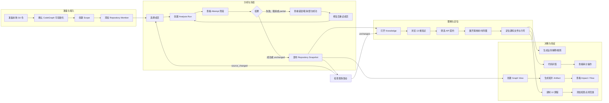

# CodeEvolution 用户旅程图

> 版本：0.1（代码基线版）  
> 服务：`services/codehistory`  
> 目的：把真实实现整理成可用于产品讨论、验收和后续埋点的核心用户旅程地图。

## 1. 旅程北极星

CodeEvolution 的核心用户不是为了“看一份代码报告”而来，而是为了完成一个具体判断：

> 我能否基于固定、可定位的代码证据，理解一个功能、评估一次影响，或验证一条用户旅程？

因此，核心旅程的完成条件是“得到证据/决策/验证结果”，不是“完成页面浏览”。

## 2. 全局旅程图



## 3. 阶段地图

| 阶段 | 用户目标 | 用户动作与触点 | 系统应该做什么 | 用户看到的产物 | 典型情绪/摩擦 | 阶段成功标准 |
|---|---|---|---|---|---|---|
| 1. 准备 | 让目标仓可被可靠分析 | 找到本地 Git 仓；安装/准备 CodeGraph；进入 Web | 检查路径、Git、CodeGraph 前置条件，给出可执行错误 | 可分析的仓库 | 不确定依赖是否齐全 | 用户知道缺什么以及如何修复 |
| 2. 接入 | 把仓库放入正确的分析范围 | Home 创建 Scope，添加一个或多个绝对路径 | 保存 Scope/Member 身份；不修改目标代码；允许多个成员组成逻辑服务 | Scope、Repository Member | 担心误删/误改仓库 | 成员路径、名称和状态可辨识 |
| 3. 分析 | 获得某个时间点的可信结果 | Snapshots 选择成员，点击“运行分析” | 创建异步 Run；按成员执行；显示校验、init/sync、冻结、分析、发布阶段 | Run、Attempt、进度和错误 | 等待时间、失败原因不明 | 成功成员拥有 current Snapshot |
| 4. 冻结 | 确保结果与源码现场一致 | 等待或查看 Snapshot 元数据 | 对源码做前后 digest；冻结源码、图谱、manifest；中途变化则不发布 | Evidence Bundle、Snapshot ID/digest | 担心结果过时 | 结果能追溯到 branch/head/dirty 和 digest |
| 5. 探索 | 找到与当前问题有关的结构事实 | Knowledge 选择分区、搜索 API/实体/函数 | 从 Snapshot 读取 13 维知识，给出统计、列表、证据位置 | Knowledge Report | 信息量大、维度多 | 用户找到目标入口或关键实体 |
| 6. 深挖 | 理解功能如何执行 | 展开 API、调用树、时序图和节点 | 按节点惰性加载调用树，绑定 Snapshot，显示文件/行号 | Call Tree、Sequence Diagram | 调用深度大、命名偏技术 | 用户能从入口走到关键实现证据 |
| 7. 语义化 | 把代码事实转成业务语言 | 配置 LLM；生成 API 解释、业务规则或节点规则 | 异步/可重试生成；显示模型、状态、覆盖率和失败 | Business Explanation、Rule、Error/State | 可能误解为真相、会产生 API 费用 | 用户能审阅解释并回到源代码验证 |
| 8. 跨仓判断 | 评估服务依赖和传播影响 | 选成员创建 Graph View，生成拓扑，选择服务/API | 以固定 View 生成 HTTP/MQ/gRPC/Redis 等证据边；查询上下游和流程 | Topology、Impact、Flow | 依赖可能歧义或未解析 | 用户能区分确定边、候选边和资源依赖 |
| 9. 问答 | 快速验证一个代码事实 | Assistant 输入符号、调用方、历史或统计问题 | 将问题规划为白名单只读操作；返回答案和操作明细；写审计日志 | Chat Answer、Audit Log | 不知道答案是否来自当前代码 | 用户知道答案对应哪个 Snapshot 和查询 |
| 10. 验证 | 把真实用户操作转成回归用例 | 登记 origin；录制点击/输入/路由；添加检查点；回放 | 脱敏记录步骤和网络；白名单限制目标；失败时保存原因/截图 | UI Recording、DSL、Run Result | WebBridge/目标环境不稳定 | 用例可重复回放并明确通过/失败 |
| 11. 更新 | 在代码变化后保持结果可信 | 检查现场改动，必要时重新运行并建立新 View | 返回 unchanged/source_changed；只发布新 Snapshot，不覆盖历史 | New Snapshot、New Graph View | 旧结果和新结果容易混淆 | 用户能明确选择旧/新事实来源 |

## 4. 核心用户旅程（按场景）

### CJ-01：首次接入并获得结构化知识（P0）

**触发**：用户第一次分析一个本地仓库，想知道系统包含哪些 API、模块和核心实体。  
**主要角色**：开发者、架构师、产品经理。

```text
准备 Git 仓和 CodeGraph
  → Home 创建 Scope
  → 添加 Repository Member
  → Snapshots 选择成员
  → 运行 Analysis Run
  → 观察 Attempt 阶段
  → 成功后打开 current Snapshot
  → 进入 Knowledge
  → 浏览 API / 模块 / 实体 / 测试 / 依赖
  → 点击具体 API 或符号查看位置
```

| 关键节点 | 用户需要的反馈 | 失败分支 |
|---|---|---|
| 添加成员 | 路径是否是 Git 仓、成员叫什么 | 路径不存在、非 Git、身份变化 |
| 运行分析 | 当前阶段、百分比、是否已发布 | CodeGraph init/sync 失败、磁盘不足、源码中途变化 |
| 发布 Snapshot | Snapshot ID、采集时间、branch/head、dirty 和完整性 | 只显示错误，不创建半成品 |
| 浏览 Knowledge | 结构化数据不依赖 LLM | LLM 未配置时提示增强能力，不阻断基础浏览 |

**完成标准**：用户能从一个列表项点击进入知识中心，并确认看到的是刚生成的 Snapshot，而不是现场代码的隐式读取。

### CJ-02：从 API 入口理解业务流程（P0/P1）

**触发**：产品经理或开发者需要解释 `POST /orders` 做了什么，或准备设计验收条件。  
**主要角色**：产品经理、开发者、测试工程师。

```text
打开 Knowledge
  → API 契约筛选 method/path/服务
  → 展开端点
  → 查看参数、处理函数、调用树
  → 展开关键节点和时序图
  → 查看文件/行号证据
  → 配置 LLM（如需）
  → 生成 API 功能解释/业务规则
  → 发现校验、授权、状态变化和副作用
  → 形成需求、验收标准或测试场景
```

**体验重点**：

- 调用树应惰性展开，避免一次加载全部图。
- 解释必须显示生成状态、覆盖率和失败节点。
- 业务语言和源码证据并列，不能只有一段无来源摘要。
- LLM 失败不影响 API 契约和调用树。

**完成标准**：用户能说清入口、主要步骤、关键规则、副作用和证据位置，并知道哪些是结构事实、哪些是模型推断。

### CJ-03：评估跨服务变更影响（P0/P1）

**触发**：架构师或开发者准备修改一个服务/API，需要知道上下游和跨通道传播范围。  
**主要角色**：架构师、开发者、运维工程师。

```text
选择多个已发布成员
  → 创建 Graph View
  → 确认 View ID、成员 Snapshot 映射和 digest
  → 显式生成 Topology Artifact
  → 选择服务
  → 查看确定依赖、候选/歧义边、Scope 外边界和资源依赖
  → 查看下游依赖与上游依赖方
  → 输入起始 API 查看 Flow
  → 根据证据决定变更范围和验证范围
```

| 用户判断 | 需要的产品信息 |
|---|---|
| “谁会被我影响？” | 下游服务、跨服务路径、通信类型和入口证据 |
| “谁依赖我？” | 上游服务、反向路径和匹配证据 |
| “这条边可靠吗？” | confidence、match rule、原始调用位置、目标处理函数 |
| “为什么没有边？” | 覆盖情况、未解析候选、Scope 外边界和成员可用性 |

**完成标准**：用户可以区分确定依赖与待复核候选，不把共享缓存/数据库误认为服务互调，并能把 Flow 映射到一个具体 API 入口。

### CJ-04：从测试缺口到可回放 UI 用例（P1）

**触发**：测试工程师发现关键函数或 API 缺乏覆盖，希望快速建立一条浏览器回归旅程。  
**主要角色**：测试工程师、开发者。

```text
Knowledge 查看测试覆盖率和 top gaps
  → 查看目标 API 调用链和业务规则
  → Assistant 打开 UI 测试
  → 登记目标名称、地址和 allowed origins
  → 打开并开始录制
  → 在目标页面执行真实操作
  → 添加“文本可见/URL/接口响应”等检查点
  → 停止录制并检查 DSL/网络请求
  → 回放
  → 查看 passed/failed、错误和截图线索
```

**安全边界**：目标 origin 白名单；密码、Token 等敏感输入脱敏；上传受目录限制；测试标签页不会被工具自动关闭。

**完成标准**：录制的用例至少有一个可验证检查点，回放结果可解释；失败能定位到步骤、检查点或目标环境。

### CJ-05：现场变更后的重新分析与故障恢复（P0）

**触发**：用户修改了仓库，或上一次多仓分析有成员失败。  
**主要角色**：所有角色。

```text
在已有 Snapshot 上检查现场改动
  → unchanged：继续使用当前结果
  → source_changed：明确提示需重新分析
  → 创建新的 Analysis Run
  → 仅重试失败成员或重新选择成员
  → 新成员成功后发布新 Snapshot
  → 创建新的 Graph View
  → 旧 Snapshot/View 仍可复查
```

**禁止行为**：

- 检查现场改动不应偷偷创建 Snapshot。
- 新 Run 失败不应清空旧 current Snapshot。
- 一个成员失败不应回滚另一个成员已经发布的结果。
- 页面刷新后不能丢失正在运行的 Run 身份。

**完成标准**：用户能回答“当前页面依据哪个 Snapshot”，并能安全地从失败状态回到可用结果。

## 5. 角色旅程对照

| 角色 | 起点问题 | 首选路径 | 主要痛点 | 最终决策/产物 |
|---|---|---|---|---|
| 产品经理 | 这个 API 对业务做什么？ | CJ-01 → CJ-02 | 技术命名、规则隐藏在实现里 | 业务流程、验收条件、待确认规则 |
| 架构师 | 这个服务和谁依赖？ | CJ-01 → CJ-03 | 多仓、异步通道、歧义边 | 影响范围、拓扑风险、架构调整建议 |
| 开发者 | 改这个函数会影响什么？ | CJ-01 → CJ-02/CJ-03 → CJ-05 | 调用关系深、结果可能过时 | 源码证据、调用路径、重分析范围 |
| 测试工程师 | 哪些关键路径没覆盖？ | CJ-01 → CJ-02 → CJ-04 | 业务规则与自动化用例脱节 | 可回放 UI 用例和检查点 |
| 运维工程师 | 哪些依赖和配置可能出问题？ | CJ-01 → Knowledge → CJ-03 | 外部依赖、共享资源和边界难识别 | 依赖清单、拓扑传播和风险清单 |

## 6. 异常与恢复地图

| 异常 | 用户感知 | 系统处理 | 下一步动作 |
|---|---|---|---|
| 没有 CodeGraph | 分析无法进入图谱阶段 | Attempt 标记 `codegraph_init` 失败并保留错误 | 安装/初始化 CodeGraph 后重试 |
| CodeGraph init/sync 超时或失败 | 某成员无法分析 | 只失败该成员；其他成员继续 | 查看阶段和错误，重试该成员 |
| 源码在采集过程中变化 | 结果无法保证一致 | Attempt 失败，禁止发布 Snapshot | 停止修改后重新运行 |
| 磁盘空间不足 | 分析中止 | 记录 `insufficient_storage` | 清理数据或调整数据目录后重试 |
| 多仓部分失败 | 一部分有结果，一部分没有 | 成功成员 Snapshot 保持可用，Run 标记 partial | 只重试失败成员 |
| LLM 未配置 | 结构知识可用，语义按钮受限 | 返回配置提示；不影响 Phase 1/2 | 打开 LLM 设置并测试连接 |
| LLM 返回空/非法结果 | 解释生成失败 | 保留失败状态和错误；不污染结构事实 | 重试或修改提示词 |
| Graph View 未生成 Artifact | View 可打开但没有拓扑 | 显示显式“生成拓扑”入口 | 创建 Job，轮询完成状态 |
| 拓扑边有歧义/未解析 | 用户看不到确定依赖 | 候选和边界单独列出，不强行投影 | 复核服务命名、规则和源码证据 |
| WebBridge 不可用或 origin 不允许 | UI 录制/回放失败 | 返回错误，不执行未授权 origin | 检查桥接服务、目标地址和白名单 |
| Snapshot 被引用或已删除 | 历史结果打不开/无法删除 | 引用保护、过期或 gone 状态明确 | 打开仍有效的 View/Snapshot，或清理引用 |

## 7. 触点与系统责任

| 用户触点 | 入口 | 系统责任 | 证据/状态接口 |
|---|---|---|---|
| 仓库列表 | `Home.vue` | 让接入、成员管理和空状态可理解 | `/api/scopes`、`/api/scopes/{id}/members` |
| 分析控制台 | `Snapshots.vue` | 给出成员级进度、取消和重试 | `/api/analysis-runs*`、`/api/repository-members/{id}/snapshots` |
| 知识中心 | `Knowledge.vue` | 以 Snapshot 为上下文展示结构事实和语义增强 | `/api/knowledge`、`/api/call-tree/*` |
| Graph View | `GraphView.vue` | 保持 View 身份，展示拓扑与影响流程 | `/api/graph-views*`、`/api/graph-artifact-jobs*` |
| 代码问答 | `RepositoryAssistant.vue` | 受控查询、审计和错误提示 | `/api/chat`、`/api/audit-logs` |
| UI 测试 | `RepositoryAssistant.vue` | 白名单录制、脱敏、检查点、回放 | `/api/ui-test-targets`、`/api/ui-recordings*` |
| LLM 配置 | `LLMSettings.vue` | 保存/测试模型配置，不回显密钥 | `/api/llm-config`、`/api/llm-config/test` |

## 8. 旅程验收清单

### 8.1 主闭环

- [ ] 空仓库状态提供“添加代码仓”下一步。
- [ ] 注册只保存路径，不修改目标仓库。
- [ ] 分析 Run 显示 Run ID、成员 Attempt、阶段、状态和错误。
- [ ] 成功发布 Snapshot 后，用户能看到 Snapshot ID 和 current 状态。
- [ ] Knowledge 请求携带 Snapshot 身份，页面能进入 API/调用树。
- [ ] 调用树节点能回到文件和行号。
- [ ] 新旧结果不会因页面刷新或新 Run 而混淆。

### 8.2 跨仓与语义增强

- [ ] Graph View 显示固定成员和 Snapshot 映射。
- [ ] Topology Artifact 必须显式创建并可轮询。
- [ ] 确定边、候选边、资源依赖和 Scope 外边界分开显示。
- [ ] LLM 未配置时基础知识仍可访问。
- [ ] LLM 产物显示状态、覆盖率、模型和失败信息。

### 8.3 验证闭环

- [ ] Chat 回答展示受控操作并写入审计日志。
- [ ] UI 录制需要 origin 白名单且敏感输入脱敏。
- [ ] 检查点至少支持文本、URL、接口响应。
- [ ] 回放明确显示 passed/failed，并保留失败原因。

## 9. 相关文档

- [产品需求文档](prd.md)
- [实现版用户旅程](user-journey.md)
- [UI 自动化用例](ui-automation-cases.md)
- [仓库级快照设计](repository-analysis-snapshot-design.md)
- [快照技术设计](repository-analysis-snapshot-technical-design.md)
